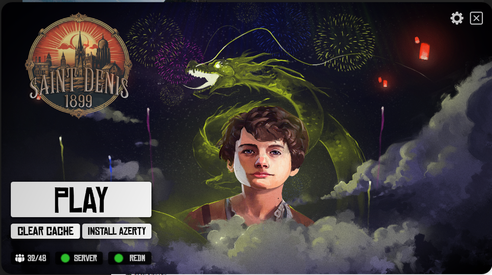
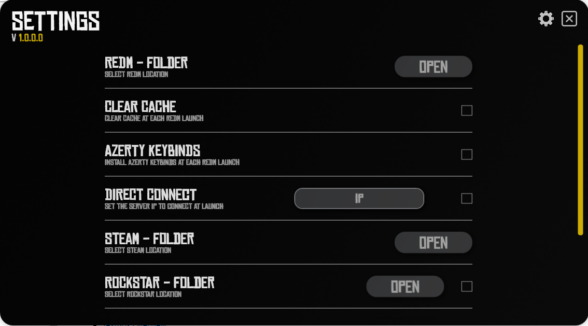
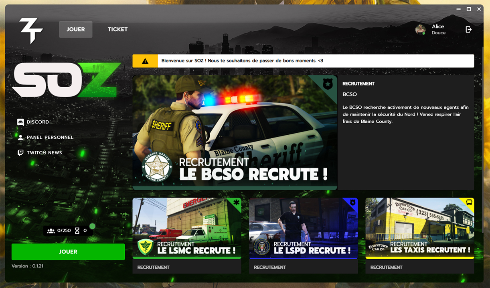
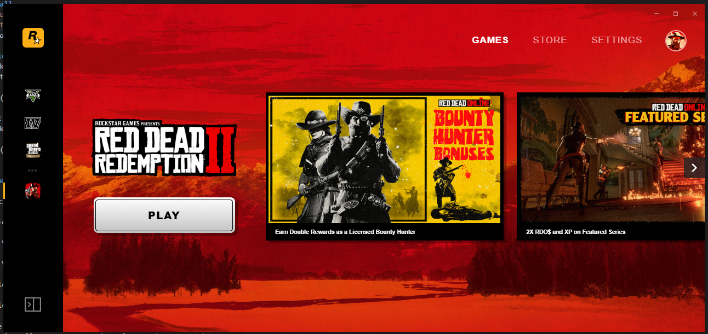
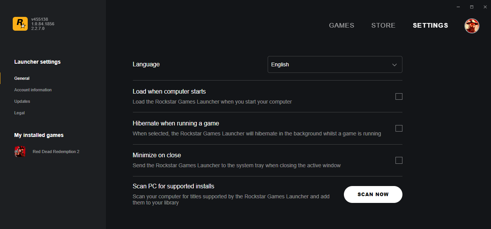

# 🤠 SaintDenis_Launcher
 The SaintDenis1899 Redm Server Launcher, it will provide all work before launching RedM (remove temporary files, launching Steam, RockstarLauncher, or EpicGameStore).

## 🙍‍♂️ Usage
The SaintDenis 1899 Redm Launcher, is intended to be used as a Client Launcher, that will start all programs necessary to connect yourself to RedM, and after, will launch your RedM Client and directly connect you to the Server.

## 🖥️ For Developers : 
### How To Install
1. [Install Visual Code with .NET desktop development module (.NET 8.0)](https://visualstudio.microsoft.com/fr/free-developer-offers/)
2. Open ```SaintDenis_Launcher.sln```
3. Press on *Play Button* (Execute)

## 🎨 MockUp : 



## 🎨 Inspiration : 
The launcher take it's inspiration on a project created by Zerator's Community, for their own server.
Another one is the RockStarLauncher UI. 





## ♻️| Advancement

✅ ReadMe Creation

✅ Repository Folder Tree Creation

✅ Main Window View Creation

✅ Main Window ViewModel Creation

✅ Main Page View Creation

✅ Main Page ViewModel Creation

✅ Setting Page View Creation
- RedM Folder + install azerty at Launch + Clear Cache at Launch
- RedM IP String + Auto-Connect or not
- Steam Folder
- Epic Folder + IsEnabled
- Rockstar Folder + IsEnabled
- TeamSpeak Folder 
- TeamSpeak String + Auto-Connect or not

☐ Setting Page ViewModel Creation

☐ App Model Creation (Storable)

✅ Navigation Logic / Routing Creation

☐ Create functions to get CFX RedM Status and Update UI to relate it

☐ Create functions to get Server Status and Update UI to relate it

☐ Create functions to Launch RedM using auto-connect to an IP or not

☐ Create functions to Clear the Cache

☐ Create functions to Launch all needed Launcher

☐ Create functions to Launch TeamSpeak on the right Server

☐ Create functions to Manage the First Launch

☐ Create functions to get RP Board Data and displaying them on the mainpage

☐ Custom Popups
